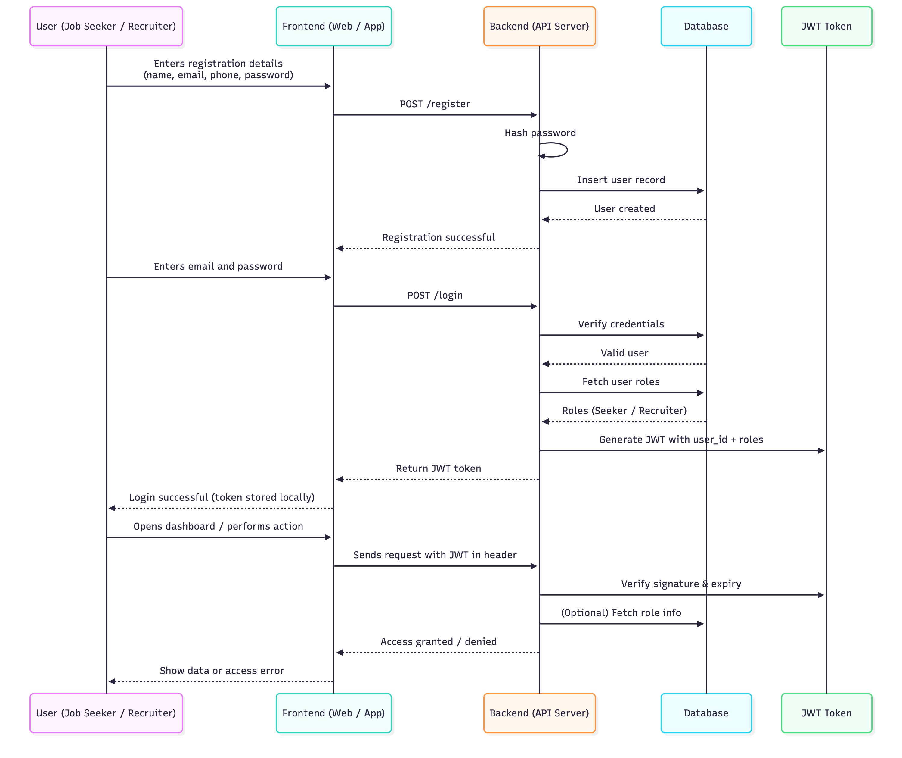

# Authentication & Authorization — Sequence Diagram (JWT Based)

---

## **Authentication & Authorization Flow**

---

### **Explanation**

| Step | Description |
|------|--------------|
| **Register** | User submits details → backend hashes password → saves to DB. |
| **Login** | Backend validates credentials → fetches roles → issues JWT. |
| **JWT Storage** | Frontend stores token (e.g. localStorage / cookie). |
| **Authorization** | Every protected API request includes JWT → backend verifies it → grants/denies access based on role. |

---