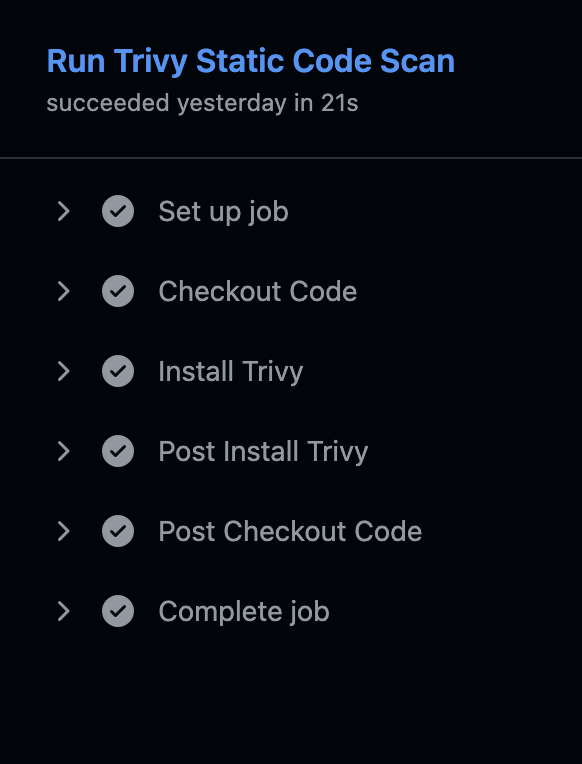
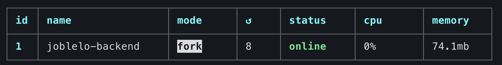

# CI/CD Pipeline and Deployment Flow

This section explains the complete CI/CD pipeline and deployment flow used in the **Joblelo Job Platform**.  

---

## 1. Code Merge Workflow

We follow a simple and clean branching strategy:

feature branches → develop → main

- Developers create **feature branches** for each task.
- Work is merged into **develop** after review.
- Once stable, changes are merged into **main**.
- Deployments are triggered only from **main** or a specific deploy branch.

---

## 2. Automated Testing

### What is tested?
- Backend: Jest + Supertest tests  
- Minimum coverage target: **80%+**

### What happens in CI?
When code is pushed to `feature/deploy` or triggered manually:

1. Install dependencies  
2. Run all backend tests  
3. Stop pipeline if any test fails

---

## 3. Security Scanning (SAST + DAST)

### SAST
We use **Trivy** to scan project source code.

- Scans for vulnerabilities in Node.js dependencies
- Runs before deployment
- Pipeline fails if HIGH or CRITICAL issues are found

### Screenshot

---

### DAST (Dynamic Analysis)
For dynamic security, we use **OWASP ZAP**.

- Scans running backend API for vulnerabilities
- Checks for SQL injection, XSS, weak headers, etc.
- Reports can be exported and reviewed

### Screenshot

---

## 4. CI/CD Workflow and Deployment Flow

This section explains how the backend is automatically tested, scanned, and deployed to the EC2 server using GitHub Actions.

### Workflow Overview

When code is pushed to the `feature/deploy` branch or the workflow is run manually:

1. **Checkout Code**  
   Fetches the latest backend source code from GitHub.

2. **Run SAST Scan (Trivy)**  
   Scans for HIGH and CRITICAL vulnerabilities in the code.

3. **Install Node and Dependencies**  
   Sets up Node.js and installs required packages.

4. **Run Tests**  
   Jest tests are executed to ensure backend stability.

5. **Deploy to EC2 (SSH)**  
   Uses `appleboy/ssh-action` to:  
   - Connect to the EC2 instance  
   - Pull the latest code  
   - Install production dependencies  
   - Restart the backend using PM2  

---

### Screenshots

#### Trivy Scan in CI  

#### Deployment Logs  

#### EC2 Running Backend  

---

## 5. Deployment Flow (Frontend on Vercel)

Frontend is deployed on **Vercel**.

### How it works:
- Every push to **main** triggers an automatic redeploy
- Vercel builds the React (Vite) project
- If build passes, deployment goes live instantly

### Screenshot

---

## 6. Summary

The CI/CD pipeline handles:

- Code checkout  
- Automated tests  
- Security scans (SAST + DAST)  
- EC2 deployment (backend)  
- Vercel deployment (frontend)  

This ensures every update to Joblelo is **tested**, **secure**, and **deploy-ready** before reaching users.
