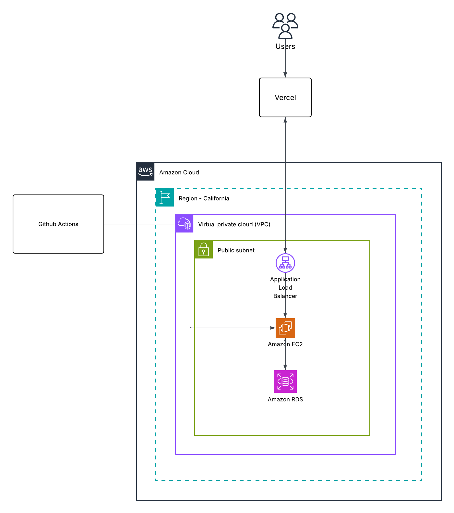

# Cloud Architecture

The AWS architecture of the Job Platform demonstrates how the system is securely deployed and managed within the AWS cloud ecosystem.

When a Job Seeker or Employer accesses the frontend hosted on **Netlify**, their requests are routed through the AWS infrastructure, which operates inside a **Virtual Private Cloud (VPC)** for isolation, scalability, and security.

---

## Architecture Diagram

---

## Architecture Description

**Netlify (Frontend Hosting):**  
Hosts the React + Tailwind frontend, providing global CDN distribution, HTTPS, and automatic deployments.

**Amazon EC2 (Elastic Compute Cloud):**  
Hosts the Node.js + Express backend application, handling API requests, business logic, and file uploads. EC2 runs inside the VPC for secure communication with other AWS services.

**Amazon RDS (Relational Database Service):**  
Manages the PostgreSQL database that stores structured data such as user accounts, job listings, and applications.

**Amazon S3 (Simple Storage Service):**  
Used for storing static assets such as resumes, profile pictures, and company logos.

**GitHub Actions (CI/CD):**  
Automates build, test, and deployment pipelines for both frontend and backend. Updates are pushed directly to Netlify and EC2 environments.

---

## Summary

This architecture ensures that the Job Platform runs in a secure, scalable, and automated environment. By combining **Netlify**, **AWS EC2**, **RDS**, **S3**, the system maintains strong performance, data integrity, and security while supporting continuous integration through **GitHub Actions**.
