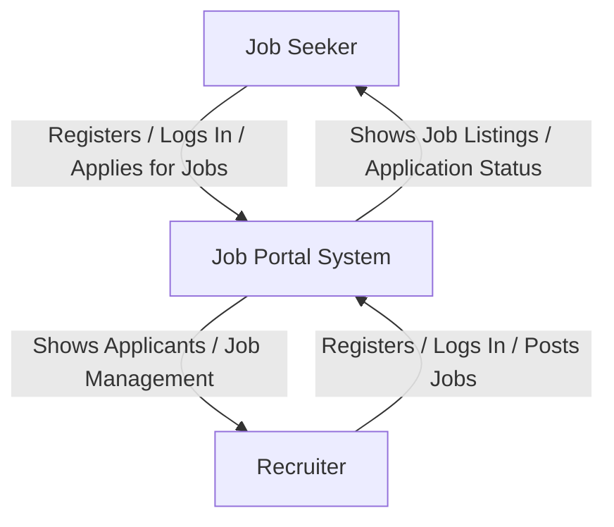

# Data Flow Diagram (DFD) — Job Portal System

---

## **Level 0 DFD**


## **Level 1 DFD**

```mermaid
flowchart TD
    %% External Entities
    A[Job Seeker]
    B[Recruiter]

    %% Processes
    P1[1.0 User Registration & Verification]
    P2[2.0 Role Assignment]
    P3[3.0 Company Management]
    P4[4.0 Job Management]
    P5[5.0 Application Management]

    %% Data Stores
    D1[(USERS)]
    D2[(ROLES)]
    D6[(USER_ROLES)]
    D3[(COMPANIES)]
    D7[(COMPANY_USER)]
    D4[(JOBS)]
    D5[(APPLICATIONS)]

    %% Flows
    A -->|Register / Login| P1
    B -->|Register / Login| P1
    P1 -->|Save User Info| D1
    P1 --> P2
    P2 -->|Assign Roles (Seeker / Recruiter)| D2
    P2 -->|Link User to Roles| D6

    %% Company Management
    B -->|Add / Join Company| P3
    P3 -->|Company Info| D3
    P3 -->|Link User to Company| D7

    %% Job Posting
    B -->|Create / Update Jobs| P4
    P4 -->|Job Data| D4
    P4 -->|Fetch Company Info| D3

    %% Applications
    A -->|Search / Apply for Jobs| P5
    P5 -->|Application Data| D5
    P5 -->|Fetch Job Info| D4
    P5 -->|Fetch User Info| D1

    %% Outputs
    D4 -->|Job Listings| A
    D5 -->|Application Status| A
    D5 -->|Applicants Data| B

```