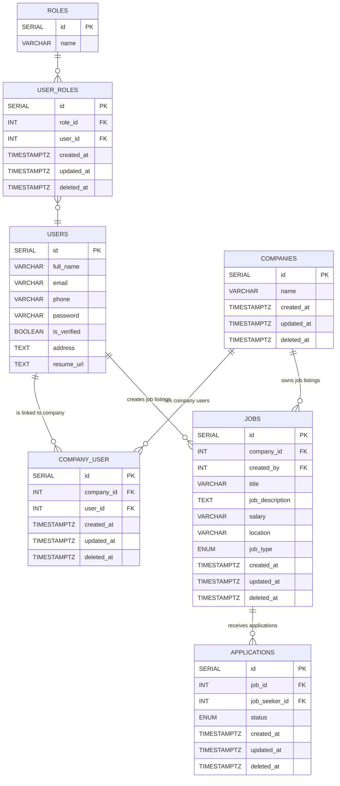

# Schema Design

This section illustrates the **database schema** used in the **Job Platform** project. The system uses **PostgreSQL** hosted on **AWS RDS**

---

## Entity Relationship Diagram (ERD)

Below is the ER diagram representing the structure and relationships between the tables:

