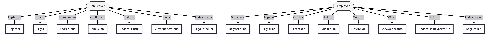

# Use Case Documentation

## 1. Use Case Overview

The **Joblelo Platform** consists of two main user roles **Job Seeker** and **Employer** each performing specific actions.  
Below are detailed use cases describing interactions between the user and the system.

---

## 2. Actors

| Actor | Description |
|--------|-------------|
| **Job Seeker** | Person looking for job opportunities. |
| **Employer** | Company or recruiter posting jobs. |
| **System (Backend)** | Node.js + Express API handling business logic. |
| **Database** | storing users, jobs, and applications. |

---

## 3. Use Case Table

### Use Case 1: Job Seeker Registration
| Field | Description |
|--------|-------------|
| **Actors** | Job Seeker |
| **Description** | Allows a job seeker to register with all required details. |
| **Precondition** | User is not already registered. |
| **Main Flow** | 1. Fill registration form → 2. Submit → 3. System validates → 4. Creates record in DB |
| **Postcondition** | Account created successfully and JWT issued. |

---

### Use Case 2: Employer Registration
| Field | Description |
|--------|-------------|
| **Actors** | Employer |
| **Description** | Employer registers by providing their details. |
| **Precondition** | Employer not already registered. |
| **Main Flow** | 1. Fill form → 2. Validate → 3. Save in DB with role=employer |
| **Postcondition** | Account created successfully and JWT issued. |

---

### Use Case 3: Job Search
| Field | Description |
|--------|-------------|
| **Actors** | Job Seeker |
| **Description** | Job seeker can browse job listings. |
| **Precondition** | User logged in. |
| **Main Flow** | 1. Enter search query → 2. Jobs are filtered → 3. Display list |
| **Postcondition** | Matching jobs displayed to user. |

---

### Use Case 4: Apply for Job
| Field | Description |
|--------|-------------|
| **Actors** | Job Seeker |
| **Description** | Apply for a job. |
| **Precondition** | User logged in and job exists. |
| **Main Flow** | 1. Click Apply → 2. User linked to application → 3. Application stored in DB |
| **Postcondition** | Job application created successfully. |

---

### Use Case 5: Create Job
| Field | Description |
|--------|-------------|
| **Actors** | Employer |
| **Description** | Employer can create a new job listing. |
| **Precondition** | Employer logged in. |
| **Main Flow** | 1. Fill job form → 2. Submit → 3. Store in DB |
| **Postcondition** | Job visible to job seekers. |

---

### Use Case 6: View Applications
| Field | Description |
|--------|-------------|
| **Actors** | Employer |
| **Description** | Employer can view applications received for posted jobs. |
| **Precondition** | Employer logged in and job exists. |
| **Main Flow** | 1. Go to My Jobs → 2. Select job → 3. View applicant list |
| **Postcondition** | Applications displayed successfully. |

---

### Use Case 7: Update Profile
| Field | Description |
|--------|-------------|
| **Actors** | Job Seeker / Employer |
| **Description** | Update profile info. |
| **Precondition** | User logged in. |
| **Main Flow** | 1. Open Profile → 2. Edit info → 3. Save |
| **Postcondition** | Profile updated successfully. |

---

### Use Case 8: Logout
| Field | Description |
|--------|-------------|
| **Actors** | Job Seeker / Employer |
| **Description** | Log out of system. |
| **Precondition** | User logged in. |
| **Main Flow** | 1. Click logout → 2. Token cleared |
| **Postcondition** | Session ended. |

<!-- ## 4. Use Case Diagram

 -->